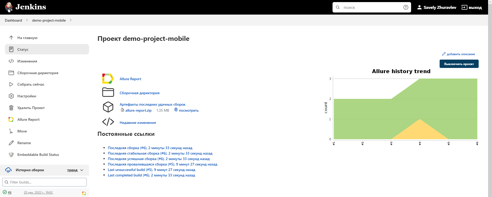
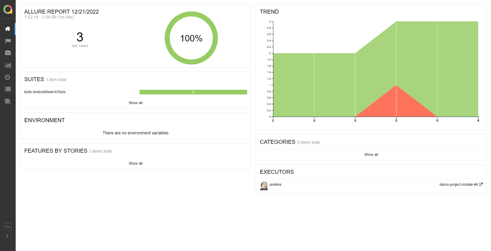

# Демонстрационный проект: Тесты мобильного приложения <a target="_blank" href="https://play.google.com/store/apps/details?id=org.wikipedia&hl=ru&gl=US&pli=1">Wikipedia App</a>.
<p align="center">

</p>

## :mag_right: Содержание:

- [Тест кейсы](#receipt-Тест-кейсы)
- [Стек](#wrench-Стек)
- [Jenkins сборка](#window-Jenkins-сборка)
- [Запуск тестов](#arrow_forward-Запуск-тестов)
- [Allure отчет](#signal_strength-Allure-отчет)
- [Видео прохождения теста](#signal_strength-Видео-прохождения-теста)
- [Отчёт в telegram](#Отчёт в telegram)

## :receipt: Тест кейсы

- Тестирование поисковой строки
- Тестирование вкладки история


## :wrench: Стек
<p align="center">


</p>

## 	:window: Jenkins сборка
</a>  <a target="_blank" href="https://jenkins.autotests.cloud/job/demo-project-mobile/">Jenkins job</a>
<p align="center">
<a href=""></a>
</p>


### :arrow_forward: Запуск тестов:
```
gradle clean test
```

## :signal_strength: Allure-отчет
</a> Отчет в <a target="_blank" href="https://jenkins.autotests.cloud/job/demo-project-mobile/allure/">Allure report</a>
<p align="center">
<a href=""></a>
</p>

## :signal_strength: Видео прохождения теста
<p align="center">
<a href=""></a>
</p>

## :signal_strength: Отчёт в telegram

<a href=""></a>


